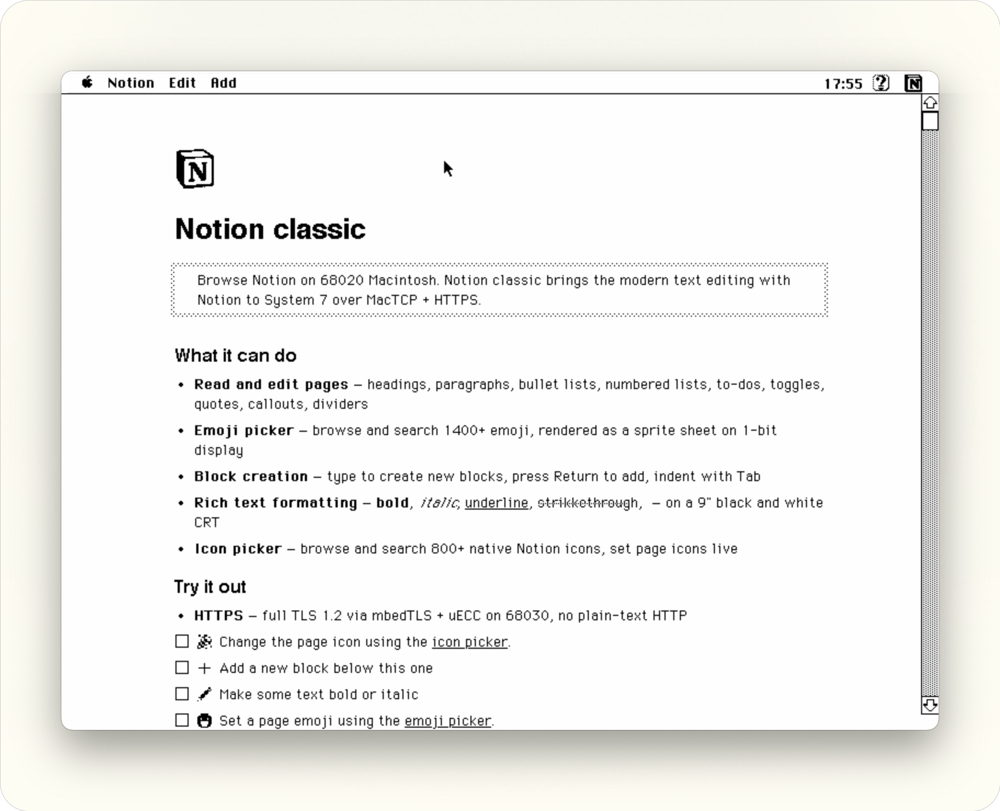
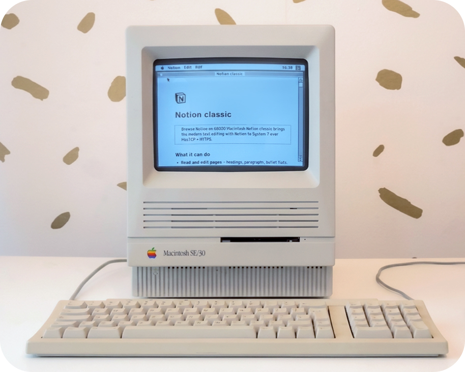

# Notion Classic

> *Edit Notion on a 1989 Macintosh: over real HTTPS, no proxy.*

---



The current version supports 1 custom Notion page to be fully edit on your classic Macintosh. Read, edit and add blocks, pick emoji, set icons: all from a 9-inch black-and-white CRT, over a real encrypted HTTPS connection.

Tested on a real Mac SE/30 running System 7.5 at 16 MHz.

```
"SE/30 over HTTPS. That's genuinely impressive —
 a 16MHz 68030 doing P-256 ECDH and TLS 1.3 against Cloudflare."
                                         — Claude Code, after many, many attempts
```

---

## The origin story

It started with a Notion documentary: an interview with the people who built the original Macintosh. Watching Andy Hertzfeld and the original Mac team talk about their work, a stupid idea formed: *what if you could run Notion on that machine?*

- 📺 [Notion × Apple documentary](https://www.youtube.com/watch?v=RLF7yfXFmUk&t=1s)
- 📝 [Notion's interview with Andy Hertzfeld](https://www.notion.com/blog/andy-hertzfeld)

The first attempt happened during COVID. Built in CLion, with out code support, pieced together from a handful of heroic open-source projects:

- [Retro68](https://github.com/autc04/Retro68): the GCC-based toolchain that makes any of this possible
- [MacPlayer](https://github.com/antscode/MacPlayer)


Unfortunately I couldnt make the page scroll with multible textfields and theprojct stalled: 
Then came Claude Code. Asking it to fix my scrolling issue.. he just fixed it. So I pushed more and more ending up wrestle TLS into shape on a 35-year-old CPU: after many failed attemepts from trying C libs for esp32 microcontroller or feeding it with algorithmic papers and then it starting to work.​​​​​​​​​​​​​​​​

My goal was to finish on the **1 April**: the end of [#MARCHintosh](https://www.marchintosh.com/) and Apple's 50th anniversary. That deadline was missed. But I have something actually works now...

---

## What it does

- **Read and edit 1 Notion page**
- **Rich text formatting**
- **Block creation**
- **Toggle headers**
- **Emoji picker**
- **Notion Page Icon's picker**
- **Full Width / Full Screen mode**: 

---


## HTTPS on a 35-Year-Old Mac

*A 16 MHz 68030 was never meant to negotiate a modern TLS handshake. 8 problems stood in the way. Claude Code helped crack them.*

<table>
<tr><td>

**1: TLS library: [mbedtls-Mac-68k](https://github.com/antscode/mbedtls-Mac-68k)** *(built by Anthony · antscode)*
>Lightweight TLS for embedded systems, compiled for 68k via Retro68.

</td></tr>
<tr><td>

**2: Bridging to MacTCP: [MacTCPHelper](https://github.com/antscode/MacTCPHelper)** *(antscode)*
>Add net_sockets_mac.c bridges mbedTLS's POSIX socket calls to the Classic Mac networking stack.

</td></tr>
<tr><td>

**3: Embedding a root certificate**
>Off course the Classic Mac doesnt have System certificates. Add a GTS Root R4 baked into the binary. WE1 intermediate skipped: P-384 is too slow on 68k.`baseline was arround 2,250 s`

</td></tr>
<tr><td>

**4: Faster ECC: [micro-ecc](https://github.com/kmackay/micro-ecc)** *(Kenneth MacKay, BSD 2-clause)*
Replaces mbedTLS's ECC math. 

> Compiled with -m68020 to use the 68020's 32-bit hardware multiply
> instructions for ECC field arithmetic. <br>`~5× speedup`.

</td></tr>
<tr><td>

**5: Add Shamir's trick + Montgomery ladder** *([Rivain, 2011](https://eprint.iacr.org/2011/338.pdf))*
>Add Point multiplication via Montgomery ladder algorithm + ECDSA verification using Shamir's trick adds <br>`~2× improvement`. 


</td></tr>
<tr><td>


**6: ChaCha20-Poly1305**
>Switched from AES-GCM to ChaCha20-Poly1305, With CPU without hardware AES acceleration was about <br>`~3–4× faster`.

</td></tr>
<tr><td>
 
**7: Custom memory allocator**
>64 KB static pool overrides malloc/free during ECC, bypassing the slow Classic Mac heap. <br>`~20× faster handshake`.


</td></tr>
<tr><td>

**8: Pre-computed ECDH key**
>Add a WarmUp() to pre-computes the ephemeral key pair before the TCP connection opens. The first attempt times still out at <br>`~15-16 s` <br> My SE/30 make the claudflare 15s time limit in the first try, But by cachesing the enough state the second attampt completes in <br>`~6.5 s`.


</td></tr>
<tr><td>

**🏁 2,250 s → ~6.5 s: ~ 346× faster**

</td></tr>
</table>


---


## Hardware & OS
- Any 68020+ Mac: Mac II, IIx, IIcx, IIci, IIsi, SE/30, Classic II, LC, Quadra, Centris, Performa.
- System 7.5 +
- 4 MB+ recommended for TLS buffers and icon cache
- Any MacTCP-compatible Ethernet: Uthernet II, Asante, Farallon, Apple Ethernet, etc.

<table>
<tr>
<td width="50%">

</td>
<td width="50%" valign="top">
<h3>Tested on</h3>
<table>
<thead><tr><th>System</th><th>Notes</th></tr></thead>
<tbody>
<tr><td>Mac SE/30, System 7.5</td><td>Primary target: real hardware with <a href="https://github.com/PiSCSI/piscsi/">PiSCSI</a> Raspberry Pi modem</td></tr>
<tr><td>BasiliskII, OS 7.5</td><td>Emulator, works well for development</td></tr>
<tr><td>PowerBook G4, OS 9</td><td>Tested via Classic environment</td></tr>
</tbody>
</table>
</td>
</tr>
</table>

---

## How to Connect your Notion

You need two things: an integration token and a page ID. Takes about 2 minutes.

1. **Get a token**: Go to [notion.so/my-integrations](https://www.notion.so/my-integrations) → New integration → Internal → Save → copy the `ntn_...` secret
2. **Share your page**: Open the page in Notion → `…` menu → Connections → find your integration → Connect
3. **Get the page ID**: Copy the page URL, or just the ID from the end of it (hyphens optional)
4. **Open Connection**: In Notion Classic: Notion menu → Connection → paste your token and page ID → Save

---


## Credits

Built by **Lin van der Slikke** with [Claude Code](https://claude.ai/code).
<br>

### The real brilliant minds behind the magic!

- [Retro68](https://github.com/autc04/Retro68)<br> autc04, Wolfgang Thaller, 68k toolchain.

- [MacPlayer](https://github.com/antscode/MacPlayer), [MacAuthLib](https://github.com/antscode/MacAuthLib), [mbedtls-Mac-68k](https://github.com/antscode/mbedtls-Mac-68k), [MacTCPHelper](https://github.com/antscode/MacTCPHelper)<br> Antscode: Anthony Super 
- [mbedTLS](https://github.com/armmbed/mbedtls)<br> Daniel J. Bernstein, ChaCha20-Poly1305         
- [micro-ecc (uECC)](https://github.com/kmackay/micro-ecc)<br> Kenneth MacKay, BSD 2-clause

-  [Rivain, M. (2011). Fast and Regular Algorithms for Scalar Multiplication over Elliptic Curves. IACR ](https://eprint.iacr.org/2011/338.pdf) <br> Matthieu Rivain, Crypto paper
- [PiSCSI](https://github.com/PiSCSI/piscsi/)<br> Hardware networking layer

<br>

And the developers @ [Notion](https://developers.notion.com) who made the API possible
<br>
<br>
<br>
<br>
<br>
<br>
